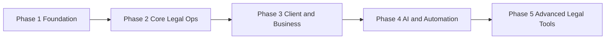

# Implementation Roadmap

High-level build order for Banwolaw Hub. Each phase has a dedicated guide under [`../phases/`](../phases/) with deliverables and acceptance criteria.

---

## Phase sequence

| Phase | Name | Primary outcome |
|-------|------|-----------------|
| 1 | [Foundation](../phases/phase-1-foundation.md) | Auth, organization, users, clients, cases, dashboard |
| 2 | [Core Legal Operations](../phases/phase-2-core-legal-operations.md) | Intake, conflict, docs, tasks, calendar, notes |
| 3 | [Client & Business](../phases/phase-3-client-business-operations.md) | Portal, comms, billing, time, reports |
| 4 | [AI & Automation](../phases/phase-4-ai-automation.md) | AI tools, approvals, e-sign, doc automation |
| 5 | [Advanced Legal Tools](../phases/phase-5-advanced-legal-tools.md) | Briefs, motions, research, evidence, e-discovery |

---

## Cross-cutting work (all phases)

Apply these continuously—not as a single late phase:

- [Security & Compliance](../modules/36-security-compliance.md) — RBAC, encryption, 2FA
- [Audit Trail](../modules/37-audit-trail.md) — activity logging
- [Global Search](../modules/33-global-search.md) — expand index as modules ship
- [Mobile & Responsive](../modules/40-mobile-responsive.md)
- [Integrations](../modules/42-integrations.md) — add providers per module need
- [Onboarding](../modules/39-onboarding.md) — wizard steps as features exist

---

## MVP alignment

[MVP scope](./mvp-scope.md) targets a **first production release** spanning Phases 1–3 plus selected Phase 4 items:

| MVP item | Primary phase |
|----------|---------------|
| Auth, roles, firm setup | 1 |
| Client & case management | 1 |
| Intake, conflict, documents (basic), tasks, calendar | 2 |
| Portal, comms, billing, time, basic reports | 3 |
| Audit logs, global search | Cross-cutting |
| AI chatbot (basic), AI drafting with review warnings | 4 (lite) |

**Post-MVP** (Phase 5 + advanced Phase 4): brief/motion tools, e-discovery, CLE, court e-filing, predictive analytics, external consultant portal, advanced evidence/approvals.

**Recommendation:** Complete Phases 1–3 for operational parity, then ship MVP with minimal AI (chatbot + drafting + governance). Defer Phase 5 until MVP is stable.

---

## Suggested milestones

| Milestone | Phases | Banwolaw can… |
|-----------|--------|---------------|
| **M0 — Dev ready** | Tech stack, DB, CI | Run app locally |
| **M1 — Internal alpha** | 1 | Manage users, clients, cases |
| **M2 — Internal beta** | 1 + 2 | Run intake → conflict → case work |
| **M3 — Client-facing beta** | 1–3 | Portal, billing, messaging |
| **M4 — MVP launch** | 1–3 + MVP AI | Full daily firm operations |
| **M5 — Automation** | 4 | AI drafting, approvals, e-sign |
| **M6 — Litigation suite** | 5 | Briefs, discovery, analytics |

Timelines are team-dependent; use milestones for sequencing, not fixed dates.

---

## Dependencies between phases

- **Phase 2** requires cases, clients, users, and roles from Phase 1.
- **Phase 3** requires documents, tasks, and calendar from Phase 2 for portal and billing context.
- **Phase 4** requires document management and case data; AI service is a separate deployable.
- **Phase 5** requires documents, filings, and optional Phase 4 AI research hooks.

---

## Key workflows by phase

Reference [key-workflows.md](./key-workflows.md):

| Workflow | Minimum phase to support |
|----------|--------------------------|
| New client → case | End of Phase 2 |
| Document drafting | Phase 2 (basic); Phase 4 (AI + approval) |
| Court filing | Phase 5 (forms + tracker); e-filing integration post-MVP |
| Billing | End of Phase 3 |
| Client portal | End of Phase 3 |
